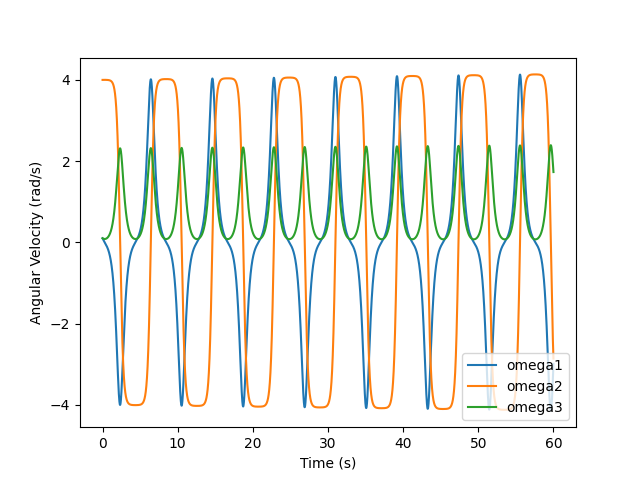

# README: Mathematical Simulation - Intermediate Axis Theorem

This Python script simulates the dynamics of a rigid body using Euler's equations to illustrate the Intermediate Axis Theorem. The theorem deals with the rotation of a rigid body with different moments of inertia about its principal axes.

## Problem Statement

The code simulates the behavior of a rigid body with unequal moments of inertia (Ixx, Iyy, Izz) around its principal axes.

### Mathematical Background

#### Intermediate Axis Theorem

The Intermediate Axis Theorem states that for a rigid body with unequal moments of inertia along its three principal axes, the axis with the intermediate moment of inertia will experience unstable rotation when spun about that axis.

#### Implementation Overview

##### Classes

- **`vector`**: Represents a 3D vector (x, y, z) used to handle angular momentum.

##### Functions

- **`find_omega_dot(w)`**: Computes angular acceleration (omegadot) using Euler's equations.
- **`update_omega(w, wdot)`**: Updates angular momentum based on the angular acceleration.

#### Simulation Details

1. **Initialization**:
   - Constants (Ixx, Iyy, Izz) are set representing the moments of inertia around the three principal axes.
   - Initial angular velocity (omega) is initialized.

2. **Simulation Loop**:
   - Using Euler's equations, angular acceleration (omegadot) is calculated based on the current angular velocity.
   - The angular momentum is updated iteratively over a time period of 60 seconds with small time steps (dt = 0.001).

3. **Data Collection**:
   - Angular velocities along each axis (omega1_list, omega2_list, omega3_list) are stored during the simulation.
   - Time values (t_list) corresponding to each velocity measurement are recorded.

4. **Visualization**:
   - The collected data is plotted using Matplotlib to display how angular velocities (omega1, omega2, omega3) change over time.

#### Results

The graph below visualizes the angular velocities (omega1, omega2, omega3) over time, showcasing the behavior predicted by the Intermediate Axis Theorem.

#### Usage

- The code can be modified by altering the initial conditions (e.g., moments of inertia or initial angular velocity) to observe different behaviors.
- Experimentation with different parameters can help gain insights into the Intermediate Axis Theorem and the dynamics of rigid bodies with varying moments of inertia.
